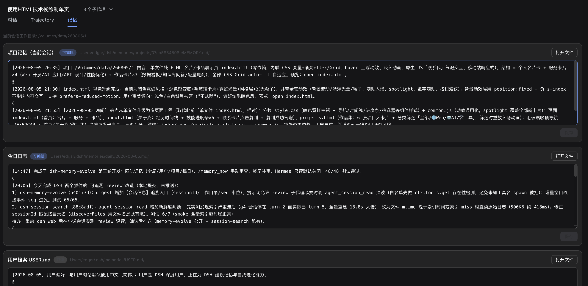
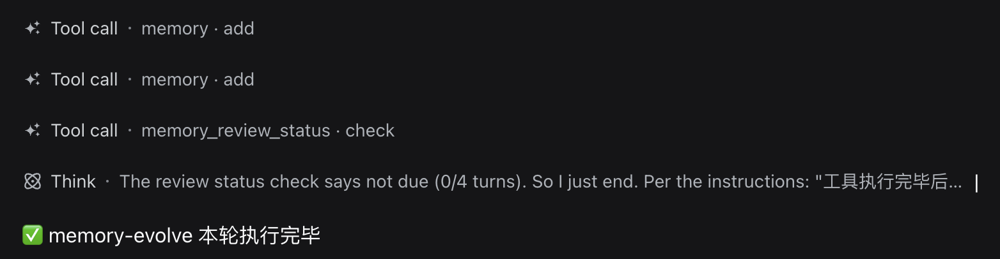

# dsh-memory-evolve

为 DeepSeek Harness 带来「跨会话长期记忆 + 后台自我进化」能力的纯插件实现：**五轨记忆 · git 分支感知 · 回合内自我审查 · 技能自我进化与技能管理器 · 四轨待办 · COI 调度 · 会话广播 · 提示词管理器 · 临时信息便签**——**零核心修改、零运行时依赖**，随装随用、卸载即净。

> **🚀 COI 调度使用文档**：[docs/COI-调度.md](docs/COI-调度.md) —— 把任务派给 kimi/codex/grok/hermes 等外部 CLI：三层入口、适配器管理、会话分层、记忆注入、命令/工具参考。**默认禁用**，启用见「Memory Evolve 设置」Tab 的「配置」。
>
> **📖 记忆与审查规则（功能说明）**：[docs/rules.md](docs/rules.md) —— 五层记忆如何工作、审查何时触发与产出什么、什么该记什么不该记、哪些需要你确认。README 只讲安装与配置。
>
> **📜 版本变更记录**：[docs/CHANGELOG.md](docs/CHANGELOG.md) —— 全部提交的中文更新日志。

## 这个插件是做什么的（30 秒了解）

**memory_evolve 是「记忆与自我进化」能力集合**：让 AI 把对话沉淀为长期记忆、待办和技能——**越用越懂你，跨会话不丢上下文**。

- 🧠 **记忆读写**：五轨记忆（长期记忆 / 用户档案 / 项目关键记忆 / 项目日志 / 今日日志），项目关键记忆**自动注入且按 git 分支过滤**；换项目、隔天继续时直接问 AI，它查记忆衔接，不用你复述
- 🔄 **记忆审查**：每隔 N 轮 AI 自动提炼值得记住的信息，提交建议由你**确认后生效**——AI 不会擅自往记忆里写东西
- ✅ **待办管理**：对 AI 说"记住 / 我要做 X"即落成结构化待办（自动分生活/工作/项目/每日，可设重要紧急与截止），到期 AI 会提醒你
- 🛠️ **技能沉淀**：反复踩坑的方法论固化为可复用技能，同类任务下次直接按流程执行（创建保持克制）；「技能管理」里可浏览、搜索并**一键启用/禁用**技能
- 🚀 **COI 调度**：把任务派给外部 CLI 代理（kimi / codex / grok / hermes 等）——**统一调度不卡 DSH 主进程**、实时看进度、会话自动分层管理可一键恢复、跨 COI 接力、任务结果留档并**自动沉淀到记忆**；内置四家适配器开箱即用，UI 可自定义添加任意 CLI
- 📨 **会话广播**：DSH 会话之间传递消息——复制本会话 ID 发给另一个会话，让它的 AI 用 `de_broadcast` 把结果**广播给你**；接收方快照**定点注入**未读提示（只对接收者可见），read 即消费；**独立开关**（broadcastEnabled，默认关闭），与 COI 调度互不影响
- 📌 **提示词管理器**：可复用的**指令范式资产库 + 注入执行器**——把常用工作范式（代码审查 / 调试 / PRD / 测试等）固化成提示词，**选中即注入：模型下一轮自动看到、不打断回复**（次数/间隔可输入任意数字，支持持续注入 / 间隔提醒，可随时停止）；也能**临时注入**——不建提示词直接输入内容注入，自动存入提示词库；内置 13 条 GitHub 真实提示词（SpecRoute / Claude-Code-Promts-Skills），分类可自定义；**默认关闭**，按需在「Memory Evolve 设置」Tab 的「配置」启用
- 📝 **临时信息**：会话页独立的「临时信息」Tab——Markdown 便签随手记，内容持久保存在 `~/.dsh/memories/scratch.md`，重启不丢，整理完后迁移或删除即可
- 🔍 **本地搜索**：记忆不足时按文件名搜本地文件——**不止文档，图片/代码/配置等一切与项目相关的文件都能找**（默认只搜文档扩展名，需要时可全类型搜索）
- 🛡️ **确认制**：AI 自建的记忆 / 待办 / 技能都先进**待确认队列**——因为这些写入会真实改变 AI 的行为（记忆进上下文、待办是给你派的活、技能改变能力库），**AI 只提议，你决定**

**怎么用得最好**：跨会话直接说"查一下记忆"；想到什么就说"记住这个 / 这个要跟进"；偶尔看看「记忆」「技能」「待办」三个 Tab 里的待确认建议，采纳或拒绝。

**闭环**：聊 → 记 → 审查 → 沉淀 → 执行——这套机制就是 AI 的长期工作记忆。

## 特性

- **分层记忆（五轨）**：用户档案 · 全局事实 · 项目关键记忆（按工作目录隔离，**自动注入上下文**，**可限定 git 分支范围**）· 项目日志（按工作目录隔离）· 每日日志，注入范围随层级收窄，互不污染；
- **每回合实时记录**：快照内固定提示行要求模型**在最终回复消息中先输出完整回复文本、再在文本之后附带工具调用**——每轮收尾向项目日志/每日日志**各写入 1 条**本回合进展，并**按重要性判断**是否向项目关键记忆（`key`）**提交建议**（用户确认后写入并注入，见「分层记忆」表），最后调用 `memory_review_status` 检查审查是否到期（到达间隔时静默执行全局记忆建议与技能审查）；时间戳、每日日志的**项目标签**与日志的 **git 分支 tag**（`[git 分支名]`）均由程序自动标注；可在「Memory Evolve 设置」Tab 的「配置」分别关闭「每回合写入项目日志 / 每日日志 / 检查项目关键记忆」；
- **回合内自我审查**：每 N 个用户回合，插件把一次记忆审查标记为到期，**主 LLM 在自己回合内静默执行**（提示词驱动 + `memory_review_status` 工具计数）——不再派生子代理、不重建转录，模型直接基于完整上下文审查：产出全局记忆建议（`memory_suggest`，用户确认后入库）并创建/优化技能；
- **可追溯审查**：审查在主会话内进行，天然拥有全部上下文（工具输出、推理过程、对话细节零损耗），无需摘要重建、无需深读接口；
- **技能自我进化（创建需确认）**：审查优化 `~/.agents/skills` 下已有技能（read-before-write 保护）；**新技能默认进入待确认队列**，会话页记忆 Tab 采纳后才移入技能库（创建门槛严格：多次踩坑、难度大、后续会复用才创建）——技能注入所有会话，必须克制；
- **技能管理器（已合并原 dsh-skill-browser）**：会话页记忆 Tab 的「技能管理」子 Tab 提供完整技能管理——按**来源层级**（用户注入 user-* / 自定义 custom / 系统 bundled / 项目 project-*）浏览全部技能，**搜索 + 来源/状态筛选 + 分页**，**一键禁用/启用技能**（shadow 机制：禁用后从模型技能目录消失、`skill` 工具拒绝加载，project 系统技能结构性不可禁用），自定义技能目录添加/移除，目录树浏览与技能文件编辑；原独立插件的**禁用列表自动迁移**，API 前缀沿用 `/skills-manager`；
- **四轨待办（dtodo）**：会话页记忆 Tab 的「待办」子 Tab 与 `dtodo` 工具提供 生活/工作/本项目（按工作目录隔离）/每日 四轨待办——§ 分隔 MD 存储（文件头注释说明 tag 语法，任何编辑器/模型可直接读取），每条带**四象限**（q1-q4，重要×紧急）、**截止日期**、**状态**（pending/doing/done/blocked/cancelled，done 自动盖完成时间）、可选分类；**用户口述直写、模型自建进待确认队列**；`dtodo list` 默认只返回**需要关注的未完成项**（逾期/今日到期/本项目/重要紧急，最多 8 条），待办内容**永不注入**（固定提示行提醒收尾检查，缓存友好）；
- **本地文件搜索（search_local_files）**：可选的 `memory_evolve_search_local_files` 工具——让模型在本机**所有磁盘/目录**中按文件名搜索文件（md/docx/pdf…，只匹配文件名、不读内容）。**默认禁用**：关闭时工具根本不注册，模型请求里没有它。启用后走**三层自适应**：平台索引（macOS `mdfind` Spotlight / Windows `es.exe`）→ `rg --files`（`--no-messages` 容忍外置卷权限错误）→ Node 并发遍历+结果缓存（零依赖兜底）；实现**可替换**：`registerSearchProvider` 注册新 provider，`searchDocsProviders` 配置顺序即可换实现，工具名/参数/返回不变。切换入口：「Memory Evolve 设置」Tab「配置」开关或 `/memory_evolve_search_files on|off`，**即时生效无需重启**；
- **COI 调度（de_coi，默认禁用）**：统一调度外部 CLI 代理的**适配器框架**——内置 kimi/codex/grok/hermes 四家开箱即用（各家命令模板/会话恢复参数/session id 提取/内置使用指南），UI 可**自定义添加任意 CLI**（含无会话恢复能力的 plain-cli 普通命令，两级配置：常用表单 + 高级规则）。**非阻塞调度**：任务后台进程化（`de_coi_dispatch` 工具 / `/de_coi run` / Web 面板三种入口立即返回 taskId），**绝不卡死 DSH 主进程**；终止杀进程树、超时兜底、会话并发锁（同一会话不并发）。**主动通知**：任务完成时结果摘要（输出尾部 1KB）注入模型**下一次生成前**的上下文（快照「COI 任务状态」段，运行中+最近完成各一行；回合内继续生成才自动可见，结束回合后需用户发消息触发）。**进度可视化**：Web「COI调度」Tab 实时日志流 + 完成回传（`de_coi_wait` 可同步等待结果，完成即返回不浪费）。**会话分层管理**：session id 自动捕获 → 按 临时/会话/项目/全局 分层入库（**默认「会话」层级 = 仅发起会话可见的私有默认**，需要跨会话协作时显式选 project/global；项目级可挂 **git 分支**，与 key 记忆同构），备注/检索/一键恢复/导出（kimi export/grok export）。**协作**：跨 COI 接力（引用任务输出自动拼接）、任务模板、任务跨会话可见、留档检索与清理（默认 90 天）、用量统计、完成通知（可配置命令模板推微信/飞书）、DSH 重启崩溃恢复（中断任务标记并可恢复会话）。**记忆融合**：任务完成自动把摘要沉淀到 project/daily 记忆轨（模块内部直连，停用记忆轨不影响调度）；**记忆注入由 AI 每次派发自主选择**（`injectTracks: ['memory','user','key']`，与 scope 无关——scope 只管归属/可见性，不注入 AGENTS.md）。入口：`de_coi_dispatch` 等工具、`/de_coi` 命令族、Web「COI调度」Tab；命令前缀 `de_` 防插件冲突；
- **会话广播（de_broadcast，默认禁用，独立于 COI 调度）**：DSH 会话之间传递消息——会话头部「⧉ 复制会话ID」按钮复制当前会话 ID，告诉另一个会话的 AI 后它可 `de_broadcast send` 发广播（可同时发给多个会话）；接收方快照**定点注入**未读提示（收件箱式 id+主题+发送者+时间，只对接收者可见，其他会话无感知），`read` 即消费、全部接收者读完后自动删除；超过 8KB 内容自动落文件、30 天清理；快照最前面另有**常驻「你的会话 ID」段**（不随开关、每会话始终注入，供 AI 比对消息收发方）。**独立开关 `broadcastEnabled`**（与 COI 调度互不影响）+ 独立存储目录（`broadcastDataDir`，默认 `<memoryDir>/broadcast`）；
- **临时信息便签（scratch）**：会话页独立 Tab「临时信息」——一个持久化的 Markdown 便签（`<memoryDir>/scratch.md`，512 KiB 上限，**原子写**保护），临时想法/随手记放这里，**跨 DSH web 重启保留**；与结构化记忆文件（§ 分隔）完全无关，是自由文本，随意编辑不破坏任何解析格式。等宽编辑区 + 显式保存（**Cmd/Ctrl+S** 快捷键，未保存有脏标记提示）+ 保存时间展示 + **一键用系统工具打开**（复用 reveal 通道）；宿主端 `GET/POST /memory-evolve/api/scratch` 路由（读不存在返回空内容，POST 整体覆盖写入）；
- **提示词管理器（Prompt Manager，默认关闭）**：会话页独立 Tab「提示词注入」——可复用的**指令范式资产库 + 注入执行器**。**库**：提示词 CRUD（名称/分类/标签/正文 Markdown）+ **分类管理**（默认 9 个内置分类（含「临时」）+ 自定义添加/删除——删除时该分类下提示词自动移到未分类，编辑提示词输入新分类名自动注册入列，**新建/临时注入时分类留空自动归入「临时」**）+ 分类树 + 搜索（名称/分类/标签/内容）+ 复制到剪贴板 + 使用统计；来源以**用户自写**为主（内置 **13 个来自 GitHub 真实提示词资产**的冷启动示例——[SpecRoute](https://github.com/Enovatr-Labs/SpecRoute)（spec-driven：代码审查/PRD→Spec/Spec→任务/任务实现/行为保持重构）与 [Claude-Code-Promts-Skills](https://github.com/Rtur2003/Claude-Code-Promts-Skills)（DEBUG 协议/安全审计/性能优化/测试策略等），**英文原文保留未加工**、内容完整（单条 2-24 KB），存放于插件包内 `lib/prompts-seed.json`（数据与代码分离，可独立替换），另附 **GitHub 范式库链接**（awesome-chatgpt-prompts、GitHub Spec Kit、SpecRoute 等，用户自取，不做爬虫导入）。**注入（有状态）**：选中提示词配置「次数 × 间隔」注入——**写入注入轨（prompt-injections.json），复用「写后即时注入、不打断回复」通道，模型下一轮自动看到**；次数支持**无限（默认，持续注入直到手动停止）**/ 一次性（1 次）/ 有限 N 次，间隔支持每回合 / **每 M 回合出现 1 次**（如"每 3 回合提醒一次"），**次数与间隔都可输入任意数字**（防御上限 9999，防手滑）；宿主监听 `agent/turn-stopping` 按回合推进（**只计主会话回合，subagent 不消耗**），有限次数耗尽自动移除、无限次永不自动过期；**每个提示词有明确状态**（未注入/注入中·剩 N 次/持续注入中），**可随时停止注入**；「注入中」浮层实时展示；**会话页 Tab 栏有活跃注入时显示红点「🔴 提示词注入 (N)」**（30s 轮询 + 注入/停止即时刷新）；正文支持 `{{date}}`/`{{time}}` 变量注入时展开。**临时注入**：不建提示词也能注入——详情栏直接输入内容点「注入」，**自动存入提示词库 + 注入生效一步完成**（分类留空归入「临时」，名称留空取内容首行，注入后自动选中可改名/改分类）。快照段 `prompt:injections` 只在出现轮非空时渲染（克制原则，间隔等待轮零开销）；注入 API 即**预留的外部触发入口**（未来监测注入只对接注入轨 add，无需改本模块）；删除提示词级联清理其活跃注入。**开关**：「Memory Evolve 设置」Tab「配置」的「提示词管理器」（默认关闭，同本地搜索/COI——普通用户不需要此功能；关闭时快照段/事件监听/API 整体卸载）；
- **建议确认制**：全局记忆（用户档案/全局事实）写入需经会话页记忆 Tab 或 `/memory_review` 确认；新技能同样需确认，杜绝无人把关的自我修改；
- **安全设计**：防漂移备份、跨进程文件锁、原子写、提示注入扫描、禁用技能保护；
- **缓存友好**：记忆快照走 user-role 尾部消息注入（变更检测），system prompt 与历史前缀保持稳定。**只注入低频变化的轨**（用户档案/全局事实/**项目关键记忆**）——项目日志与每日日志随每回合主动写入而变化，若注入会导致每轮追加新的上下文快照、前缀缓存命中率下降，因此它们**默认不注入**，改为按需读取 + 快照中一行**固定提示**要求模型每轮收尾调用 memory 工具写入并检查（提示文本固定不变，不产生新快照）。项目关键记忆（`key`）只在出现长期事实时才写入，低频稳定，与全局轨一样用**实时读取 + 变更检测**注入——写入后下一轮即出现在模型上下文中。

## 分层记忆

| 层 | 内容 | 注入方式 | 写入方式 |
|---|---|---|---|
| 用户档案（`user`） | 用户是谁、偏好、沟通方式 | 每会话注入（低频变化，缓存友好） | 建议确认制（`/memory_review`） |
| 全局事实（`memory`） | 环境、工具、惯例 | 每会话注入（低频变化，缓存友好） | 建议确认制 |
| 项目关键记忆（`key`） | 当前项目的长期事实（约定/决策/架构/踩坑） | **注入当前项目会话**（低频变化，缓存友好；按 cwd 隔离；**按 git 分支过滤**，当前分支名随 key 一起注入） | **模型写入需确认**（进待确认队列，采纳后写入并注入）+ 记忆 Tab 手动添加（直写） |
| 项目日志（`project`） | 当前项目的约定与进展 | **不注入**，按需读取（`memory` 工具，按 cwd 隔离） | 每回合主动写入（无需确认） |
| 每日日志（`daily`） | 今天做了什么 | **不注入**，按需读取（`memory` 工具） | 每回合主动写入（无需确认） |

记忆文件位置（默认 `~/.dsh/memories/`）：

```
~/.dsh/memories/
├── MEMORY.md                       # 全局事实（§ 分隔条目格式）
├── USER.md                         # 用户档案
├── SUGGESTIONS.jsonl               # 待确认建议队列
├── MEMORY-archive.md               # 归档记忆（不注入，可转正）
├── USER-archive.md                 # 归档用户（不注入，可转正）
├── scratch.md                      # 临时信息便签（自由文本，非 § 格式，随意编辑）
├── prompts.json                    # 提示词库（提示词管理器：CRUD + 分类 + 统计）
├── prompt-injections.json          # 注入轨（活跃注入条目 + 剩余回合计数）
├── skills-state.json               # 技能禁用列表 + 自定义技能目录（技能管理器）
├── TODOS-life.md                   # 生活待办（§ 分隔 + 文件头 tag 说明）
├── TODOS-work.md                   # 工作待办（跨项目）
├── TODO-archive.md                 # 待办建议归档（可转正回对应待办轨）
├── daily/YYYY-MM-DD.md             # 每日日志（按天分文件）
├── daily/YYYY-MM-DD.todo.md        # 每日待办（与日志分离，按天分文件）
└── projects/<cwd-hash>/            # 项目记忆（每个工作目录独立）
    ├── MEMORY.md                   # 项目日志（每回合追加）
    ├── KEY.md                      # 项目关键记忆（长期事实，注入上下文）
    ├── KEY-archive.md              # 项目关键记忆归档（不注入，可转正）
    └── TODOS.md                    # 项目待办（cwd 隔离）
```

## git 分支与记忆

同一个项目（同一工作目录）的不同 git 分支可能有着完全不同的逻辑与约定（稳定分支 vs 实验分支、新旧架构分支）。为了让记忆不串味，插件的项目级记忆**全程感知当前分支**：

- **当前分支识别**：程序实时执行 `git branch --show-current`（与 DSH TUI 同款），非 git 仓库 / 获取失败 / detached HEAD 时视为无分支——所有分支相关行为自动退化为"全部"。
- **key 记忆按分支范围注入**：key 条目可带 `[branch:main,dev]` 标记限定可见分支；**无标记 = 全部**（所有分支可见，历史条目天然如此）。注入时只注入「无标记」+「标记覆盖当前分支」的条目，**当前分支名随 key 一起注入**（快照 key 小节标题 + 提示行「当前 git 分支」），让模型明确知道自己所在分支。
- **分支范围管理**：记忆 Tab 的 KEY 页签里，每条 key 显示「分支: 全部 ▾ / 分支: main,dev ▾」徽标，点击展开多选（全部与具体分支互斥，「全部」权重最大）；手动添加时可同时选择分支范围；模型提交建议时可用 `branches=main,dev` 参数（缺省=全部，不存在的分支会警告但照常写入）。
- **日志分支 tag**：项目日志与每日日志的每一条记录**自动带来源分支 tag** `[git main]`（程序标注，模型无需也无法手写——手写前缀会被剥离），日志可溯源到分支，跨分支回顾时不会张冠李戴。
- **开关**：`keyBranchFilter`（默认 true，仅 config.yaml）可关闭 key 的分支过滤注入。

## 技能管理器（合并自 dsh-skill-browser）

> ⚠️ **与独立插件 dsh-skill-browser（dsh-skills-manager）冲突**：技能管理功能已整体并入本插件（宿主端 `lib/skills-manager.js` + 记忆 Tab「技能管理」子 Tab，API 前缀沿用 `/skills-manager`）。**不要同时启用两者**——两套 disabled shadow 会对同一技能重复注册、两套 custom-dir provider 会重复扫描。迁移步骤：从 `~/.dsh/config.yaml` 移除 `skills-manager` 的 insert，重启 `dsh web`。

- **入口**：会话页「技能」Tab → 「技能管理」子 Tab（与「待确认技能建议」并列，三栏布局：技能列表 + 目录树 + 文件查看/编辑器）。
- **技能总览**：全部技能按来源分层展示——`user-dsh` / `user-agents`（用户注入）、`custom`（自定义目录，含本插件 UI 添加的）、`bundled`（系统内置）、`project-dsh` / `project-agents`（项目级，标「系统」徽标、**不可禁用**）；每张卡片显示名称、描述、适用场景、来源徽标、资源类型。
- **搜索筛选**：关键字搜索（名称/描述/适用场景，支持中文）+ 来源筛选（带数量统计）+ 状态筛选（全部 / 可用 / 已禁用）+ 分页。
- **禁用 / 启用**：一键禁用把技能从模型技能目录中移除（注册 `modelInvocable: false` 的 runtime shadow，rank 250 覆盖 user/custom/bundled 源但压不过 project 源——系统技能的结构性边界），模型不再看到、`skill` 工具拒绝加载；随时可重新启用；选择持久化保存，重启后恢复。`skill_manage` 工具天然跳过被禁用的技能。
- **自定义技能目录**：直接添加/移除你自己的技能目录（`<目录>/<技能>/SKILL.md` 或 `<目录>/<技能>.md` 布局，`~` 展开），与已有技能根重叠的路径会被拒绝；永久保存，重启后自动加载。
- **文件浏览与编辑**：选中技能后以目录树浏览其本地目录（懒加载、面包屑、根切换），点击文本文件查看/编辑（行号、Ctrl/Cmd+S 保存、未保存确认）；读写均限技能目录范围内，越界/二进制/超大被拒。
- **禁用列表迁移**：首次启动（无 `skills-state.json`）时自动从原独立插件的 `~/.dsh/plugins/dsh-skill-browser/state.json` **一次性导入**禁用列表与自定义目录并持久化——卸载原插件不会丢你的选择；之后以本插件的 `~/.dsh/memories/skills-state.json` 为准。

## 待办（dtodo）

会话页记忆技能 Tab 的「待办」子 Tab 与 `dtodo` 工具提供四轨待办管理，与记忆系统完全同构：

- **四轨**：`life` 生活（个人琐事）· `work` 工作（跨项目的正事）· `project` **本项目**（当前工作目录的待办，**按工作目录隔离**——换个目录就看不到）· `daily` 每日（按天分文件，与每日日志分离）；
- **存储格式**：§ 分隔 MD 文件（与 MEMORY.md 同构，任何编辑器/模型可直接读取）；**文件头 HTML 注释说明 tag 语法**（人/模型打开文件即可读懂，解析时剥离）；每条待办首行元数据 tag：创建时间（程序盖戳）、`[id: xxxxxxxx]` 唯一标识、`[q1]`~`[q4]` 四象限（重要×紧急）、`[due: YYYY-MM-DD]` 截止、`[status: …]` 状态（pending/doing/done/blocked/cancelled，done 自动盖 `[done: …]` 完成时间）、`[cat: …]` 可选分类；正文可多行；
- **dtodo 工具**：
  - `dtodo add content=… [target=life|work|project|daily] [quadrant=q1..q4 | important urgent] [due=YYYY-MM-DD] [cat=…]`——**用户口述直写**（target 缺省=project，无 cwd 用 work）；
  - `dtodo list [target] [status] [quadrant] [due=today|overdue|all] [date=YYYY-MM-DD] [all=true] [past=true] [expired=true] [cwd=…]`——**默认智能视图**：逾期 + 今日到期 + 当前项目未完成 + 全局 Q1/Q2 未完成，排序（逾期 > 今日 > Q1 > Q2 > 其余）后最多 **8 条**；已完成/已取消不进默认视图；全量需显式 `all=true` 或筛选参数（工具层硬过滤，模型只能读到该关心的）；**`past=true` 同时查询每日待办的过往**（今天之前的 daily 文件，条目带日期、排最后），默认**不返回已过期的遗留**（未完成且无未来截止），`expired=true` 时才全部显示——过往默认不出现、不增加模型负担；**`cwd=路径` 跨项目查询**（在别的会话里查指定项目的 `target=project` 待办，project 轨按该路径定位，缺省=当前会话目录）；
  - `dtodo done <id>` / `dtodo update <id> [status|quadrant|due|cat|content]` / `dtodo remove <id>`——按 **id 精确操作**（list 输出带 id；每日**过往条目的 id 同样可操作**，写回对应日期的文件）；
- **写入权限**：你口述的待办直写；模型**自建待办**（审查/工作中发现"值得做"）用 `memory_suggest target=todo-life|todo-work|todo-project|todo-daily` **进待确认队列**，采纳后写入对应轨——模型不能自作主张派活；
- **注入策略**：待办内容**永不注入**（状态变化不产生任何尾部注入）；快照只带一条**固定提示行**——收尾时 `dtodo list` 检查到期、有到期项在回复末尾提醒用户、不要主动展开全部清单；
- **归档**：待办建议可归档到 `TODO-archive.md`（条目带「原轨」标记，转正时写回对应待办轨）；已完成待办保留在文件中，随时可查看/恢复；
- **UI**：「待办」子 Tab 默认显示**全部**四轨（页签：全部 / 生活 / 工作 / 本项目 / 今日 / **过往**，每条带轨徽标；「今日」=当天的每日待办，「过往」=今天之前的每日待办，按日期分组显示），页签下方有一行使用说明小字（各轨含义 + 如何添加）；状态/四象限筛选 + **「显示已过期」开关**（默认关闭：过往的已过期遗留默认隐藏，勾选后全部显示；**历史文件按需读取**——只有点开「过往」页签或勾选「显示已过期」时才请求，其余视图零额外开销）；快速添加框（全部视图可选目标轨，单轨视图固定当前轨，过往视图不提供添加）、每条待办的完成/恢复、行内编辑（内容/象限/截止/状态）、删除（确认）；逾期条目标红。

## 临时信息（scratch）

会话页顶部的独立 Tab「临时信息」——一个**持久化的 Markdown 便签**，与记忆/技能/待办等 Tab 并列（conversation.view entry，探测 host API 存在即注册，无需开关）：

- **用途**：临时想法、随手记都放这里——内容持久保存在 `~/.dsh/memories/scratch.md`，**跨 DSH web 重启保留**；整理完成后迁移到别处或删除即可；
- **与记忆文件无关**：scratch.md 是自由文本（不是 § 分隔的结构化记忆），用户可以随意编辑，**不会破坏任何解析格式**；读写均有大小上限（512 KiB）与**原子写**保护（先写临时文件再 rename）；
- **编辑体验**：等宽字体编辑区（Markdown 格式）+ 显式「保存」按钮（**Ctrl/Cmd+S** 快捷键，只在编辑区聚焦时拦截）+ **未保存脏标记**提示 + 上次保存时间展示 + 保存/加载失败提示；
- **用系统工具打开**：一键在系统编辑器/访达中打开 scratch.md（复用宿主 reveal 通道）；
- **API**：`GET /memory-evolve/api/scratch`（读取，不存在返回空内容）`POST /memory-evolve/api/scratch`（整体覆盖写入，body 上限放宽到文档上限）。

## 提示词管理器（Prompt Manager）

会话页顶部的独立 Tab「提示词注入」——**指令范式资产库 + 注入执行器**，复用插件的「写后即时注入、不打断回复」通道：注入的本质是把一段指令写进快照可见的位置，模型**下一轮**生成时自动看到，写入发生在后台、不打断正在进行的回复。

- **提示词库**（`<memoryDir>/prompts.json`）：名称 + 分类 + 标签 + 正文（Markdown）；三栏布局（左分类树 / 中列表 / 右详情表单）；**分类可管理**：默认 9 个内置分类（开发流程/问题排查/设计/测试/质量/性能/文档/产品/**临时**），左下「＋ 新分类」添加、分类行 hover 出「×」删除（删除确认弹窗提示该分类下提示词将移到未分类）；编辑提示词时分类输入框带已有分类建议（datalist），输入新分类名保存后自动注册；**新建/临时注入时分类留空自动归入「临时」**；搜索覆盖名称/分类/标签/内容；复制按钮直接进剪贴板；每次注入记录使用次数与最近注入时间；删除提示词时**级联清理**其活跃注入；
- **注入（有状态）**：配置「次数 × 间隔」——次数：**无限（默认，持续注入直到手动停止）/ 一次性 / 有限 N 次**；间隔：每回合 / 每 M 回合一次；**次数与间隔都是自由数字输入**（任意整数，防御上限 9999）。注入轨条目带 `roundsLeft`（剩余次数，**null=无限**）+ `every`（间隔）+ `countdown`（距下次出现回合数），宿主监听 `agent/turn-stopping`（回合即将关闭）按 **countdown 模型**推进（出现轮消耗一次 → 间隔 `every-1` 轮不出现 → 再出现；无限不消耗、永不自动过期；**subagent 回合不消耗**）；有限次数耗尽自动移除并落盘。**每个提示词有明确状态**：列表项带「注入中·剩 N 次 / 持续注入」徽标、详情面板显示状态与节奏，「注入中」浮层与「停止注入」按钮可随时结束；已注入的提示词不可重复注入（先停止再注入）；
- **临时注入**：不建提示词也能注入——未选中任何提示词时，详情栏即「临时注入」表单（名称可选 + 内容必填 + 分类可选 + 次数/间隔），点「注入」**自动存入提示词库 + 注入生效一步完成**（分类留空归入「临时」，名称留空取内容首行，注入后自动选中该新条目，可继续改名/改分类）；
- **Tab 红点**：会话页 Tab 栏有活跃注入时 label 显示 **「🔴 提示词 (N)」**（N=注入中条目数；30s 轮询注入轨 + 注入/停止操作即时触发刷新）；
- **快照段 `prompt:injections`**（order 520，在记忆快照之后）：**只渲染出现轮**（countdown===0）的注入——`## 用户规则（必须遵循）` + 逐条「标题：」+ 内容全文（**命令式指令文案，写给模型看，不含"注入"字样与任何机制/GUI 话术**）；间隔等待轮与空轨返回空串——零注入零开销，遵守快照克制原则；
- **变量展开**：正文中的 `{{date}}`（当天日期）与 `{{time}}`（当前时刻）在注入时自动展开；实现预留 vars 覆盖参数（二期监测注入的 `{{path}}`/`{{event}}` 等由此扩展）；
- **来源**：内置 13 个来自 GitHub 真实提示词资产的冷启动示例（`lib/prompts-seed.json`，首次运行 seed，已有数据不覆盖；见 `docs-local/builtin-prompts.md`）；「来源」浮层列出 GitHub 范式库链接（awesome-chatgpt-prompts / GitHub Spec Kit / SpecRoute / ai-specs / lidr-specboot 等）供用户自取——**不做爬虫导入**，主要来源是用户自己写；
- **API**（前缀 `/memory-evolve/api/prompts`，与 COI 同构独立 prefix）：
  - `GET/POST /prompts`、`PUT/DELETE /prompts/:id`——提示词 CRUD；
  - `POST /prompts/:id/inject {rounds, every}`——写入注入轨（rounds=次数，**0=无限**，任意整数、防御上限 9999；every=间隔回合数，任意整数、默认 1；重复注入同一提示词被拒；展开变量；记录使用统计）；
  - `GET /prompts/injections`、`DELETE /prompts/injections/:id`——注入轨查看/停止注入；
  - `GET /prompts/sources`——GitHub 来源链接；
  - `GET/POST /prompts/categories`、`DELETE /prompts/categories/:name`——分类管理（添加/删除，删除时该分类提示词移到未分类）。
- **扩展口**：注入 API 即预留的外部触发入口——未来文件/Git/端口等**监测注入**（二期）只对接注入轨 `add`，本模块无需改动。
- **开关**：「Memory Evolve 设置」Tab「配置」的「提示词管理器」（**默认关闭**，与本地搜索/COI 一致——普通用户不需要此功能；开启后快照段/事件监听/API 安装、Tab 刷新后出现；关闭整体卸载，存储数据保留）。

## 会话广播（de_broadcast）

DSH 会话之间传递消息的轻量子功能，**独立于 COI 调度框架**（独立模块：独立开关、独立存储目录、独立装配，不借任务/留档机制）。**开关 = 独立「会话广播」（broadcastEnabled，默认关闭，可单独开启）**——开启 = de_broadcast 工具 + 会话头部「⧉ 复制会话ID」按钮 + 快照「会话广播」未读提示，与「COI 调度」开关互不影响。

- **使用方式**：
  1. 会话头部「⧉ 复制会话ID」按钮（会话标题栏操作区）一键复制当前会话 ID；
  2. 把 ID 粘贴到另一个会话的输入框，告诉那个会话的 AI："总结一下 XX，发给会话 <ID>，内容是……"；
  3. 对方 AI 调用 `de_broadcast send`（recipients 传会话 ID 数组，支持同时发给多个会话；subject 可填主题，缺省取内容首行）；
  4. 接收方会话的 AI 在**下一次生成前自动看到**快照「会话广播」段：收件箱式列出未读消息（每条含 消息ID + 主题 + 发送者 + 时间），可直接 `de_broadcast read` 查看全文处理。
- **核心机制**：
  - **定点注入**：快照「会话广播」段只对接收方会话注入（服务端按 recipients 过滤），其他会话完全无感知——比 scope 更精确（scope 是"工作区/全局"粒度，广播是"指定会话"粒度）；
  - **收件箱式快照**：快照直接列出未读消息的 id+主题+发送者+时间（不注入正文，克制），AI 看到即可 read，无需先 list；标题为 AI 指令式（必须逐条 read 处理，未处理完不要结束回合）；
  - **read 即消费**：read 返回全文并标记已读；**全部接收者已读后消息自动删除**（单接收者 = read 即删；多接收者各自读，最后一个读完触发删除，绝不提前删导致其他接收者收不到）；
  - **长内容**：超过 8KB 自动写入文件 `broadcast/broadcasts/<id>.txt`，接收方 read 时返回全文（文件随消息删除一并清理）；
  - **清理**：30 天自动过期兜底（启动 + 每日定时 prune）。
- **工具（de_broadcast，action 参数）**：`send`（recipients 必填 / content 必填 / subject 可选）/ `list`（收件箱式：只显示主题+简介，像邮件列表）/ `read`（全文并标记已读，快照提示随之消失）/ `delete`（手动删除，发送方或任一接收方可删）。
- **消息模型**：`{ id, sender（服务端自动填）, recipients: [会话ID...], subject, content, createdAt, readBy: [已读会话ID...] }`。
- **存储与开关**：独立存储目录 `<memoryDir>/broadcast/broadcast.json`（消息数组）+ `broadcast/broadcasts/<id>.txt`（长内容，配置项 `broadcastDataDir`）；**独立开关 `broadcastEnabled`**（默认关，可单独开启）；recipients 数组设计兼容未来扩展（project:<路径> / global 伪接收者 → 项目广播/全局广播）。
- **常驻「你的会话 ID」快照段**：快照**最前面**有一个常驻段（**不随任何开关，每个会话始终注入**）：`## 你的会话 ID … - 你的会话 ID：session-xxx`——AI 始终知道"我是谁"：接收/回复广播消息时用自己的 ID 与消息里 sender/recipients 比对判断谁是发件人、谁是自己（不依赖 → 符号）；回复时把自己的 ID 告知对方；未来其他模块的消费者也会用；subagent 等无会话视角不注入。

## 安装

### 标准安装（DSH 08-06+ profiles 架构，推荐）

插件以包形式安装进 profile（`web` / `tui` / `headless` 等），由 profile 的
`cordis.patch.yml` 组合。以 web profile 为例：

```sh
# 1. 安装到 profile（本地目录用 link:，也可用 git/registry 包地址）
dsh plugin --profile web add link:/path/to/dsh-memory-evolve

# 2. 在 profile 的 patch 层注册（编辑 ~/.dsh/profiles/web/cordis.patch.yml）：
```

```yaml
- insert:
    - id: dsh-memory-evolve
      name: dsh-memory-evolve
      config:
        reviewEnabled: true      # 开启回合内记忆审查（默认关）
        reviewInterval: 10       # 每 10 个用户回合审查一次
```

重启 `dsh web` 即生效。卸载：删除 patch 中的 insert 行 + `dsh plugin --profile web remove dsh-memory-evolve`，一切效果随插件卸载自动清理。

> 注意：client bundle 注册 ID 取自 `package.json` 的 `name`，patch 行的
> `name` 必须与之完全一致（`dsh-memory-evolve`），不要加 `@dsh-local/`
> 前缀——那是 08-06 之前旧机制的软链命名空间。

### 旧机制（DSH 08-06 之前，不再推荐）

```sh
mkdir -p ~/.dsh/plugins
cp -r dsh-memory-evolve ~/.dsh/plugins/
ln -s ~/.dsh/plugins/dsh-memory-evolve ~/node_modules/@dsh-local/dsh-memory-evolve
```

在 `~/.dsh/config.yaml` 追加（08-06 起该文件已不再被读取，仅旧版 DSH 适用）：

```yaml
- insert:
    - id: dsh-memory-evolve
      name: '@dsh-local/dsh-memory-evolve'
      config:
        reviewEnabled: true
        reviewInterval: 10
```

## 用法

### 模型侧

agent 会通过 `memory` 工具读写记忆，通过 `skill_manage` 工具管理技能。用户也可以直接说"记住 XXX"。

启用后（`searchDocsEnabled`，默认关），agent 还可通过 `memory_evolve_search_local_files` 工具在**本机全盘**按文件名搜索文件：

- `memory_evolve_search_local_files query=写小说 exts=["md","docx"]`：文件名关键字 + 扩展名（支持 `"md,docx"` 字符串），结果按修改时间倒序；**中文文件名建议尝试多个说法**（"年报"查不到可换"述职"、"年度报告"等文件名里实际出现的词）；
- `memory_evolve_search_local_files query="" exts=["md"] limit=5`：不传关键字 = 列出最近修改的文档；
- **全类型搜索（图片/视频/任意扩展名）必须显式确认**：`allTypes=true`（或 `exts=["*"]`）——副作用是结果集可能很大、首次全盘扫描较慢，非必要不用；
- **文件夹搜索**：`type="dir"`（或 `type="all"` 文件+文件夹），如 `query=年终 type="dir"` 找文件夹名；
- `dir` 可选限定目录；`limit` 默认 20 最大 100。只返回路径/名称/大小/修改时间，**不读取文件内容**。

`memory` 工具参数：`action`（add / replace / remove / list）+ `target`（memory / user / project / key / daily）。

- `memory add target=project content=...`：写入当前项目的日志；
- `memory add target=key content=...`：提交当前项目的**关键长期记忆建议**（与全局轨同待遇——**用户确认后**才写入 KEY.md 并注入；`branches=main,dev` 可选参数限定 git 分支范围，缺省=全部）；`memory list target=key branch=main` 查看该分支可见的条目（无标记的全部条目 + 标记含该分支的条目）；记忆 Tab「待确认记忆建议」中采纳 key 建议后生效；
- `memory list target=daily`：查看今日日志；
- `memory list target=daily filter=关键词 since=2026-08-01 until=2026-08-06 recent=true limit=10`：查询日志——关键词过滤、日期范围（**daily 支持跨文件查历史日志**）、最新在前、条数上限；**查不到匹配或存在日期无法解析的旧格式条目时，返回会提醒模型去掉过滤条件读取全文核对**；
- replace/remove 用唯一子串片段匹配。

### 会话页记忆 / 技能 / 待办 / 设置 Tab（唯一管理入口）

会话页顶部有 **记忆 / 技能 / 待办 / Memory Evolve 设置** 四个独立标签页（`memoryTabEnabled` **默认开启**，仅可通过 config.yaml 配置——它不是运行时可改项，避免在 Tab 内关闭后无法找回），是插件的**唯一管理入口**（原设置面板的「记忆管理」已移除，功能全部并入这些 Tab）。每个 Tab 都有一个**「指南」子 Tab**：设置 Tab 的指南是**整个插件所有功能的简单介绍**，其余 Tab 的指南是**各自功能的详细介绍**。

**Memory Evolve 设置 Tab**（放最后，两个子 Tab）：

- **指南**：整个插件 30 秒速览——五轨记忆、回合内审查、待办、技能、COI 调度、提示词注入、临时信息、本地搜索、确认制的用途简介；
- **配置**（原「运行时配置」）：`reviewEnabled` / `reviewInterval` / `skillReviewEnabled` / `perTurnProjectWrites` / `perTurnDailyWrites` / `perTurnKeyWrites` / `searchDocsEnabled`（本地文件搜索工具开关）等的表单修改，保存后**立即生效并持久化**（覆盖 config.yaml 对应项，重启不丢）。本地搜索 / COI 调度 / 提示词管理器 / 临时信息的**启用开关都在这里**。

**记忆 Tab**：顶部是一行**功能 Tab + 文件页签**（竖线分隔），功能 Tab：

- **指南**：记忆功能详细介绍（五轨记忆、文件页签、git 分支感知、编辑维护、待确认建议机制）；
- **待确认记忆建议**：列出全部待确认建议（含 **key 项目关键记忆建议**——采纳后写入该项目 KEY.md 并注入），**采纳前可编辑文本**（修改后再入库），逐条「采纳 / 归档 / 拒绝」或批量处理——**归档**把不够格进主记忆但丢了可惜的建议存入 `MEMORY-archive.md` / `USER-archive.md`（key 建议归档到该项目的 `KEY-archive.md`）；
- 有未确认的记忆建议时，会话页的「记忆」标签会显示 **🔴 小红点 + 计数**，提示你处理。

**技能 Tab**（三个子 Tab）：**指南**——技能功能详细介绍（技能是什么、如何沉淀、创建纪律）；**待确认技能建议**——审查创建的新技能在此「采纳」（移入技能库，立即生效）或「拒绝」，有未确认技能时「技能」标签显示 **🔴 小红点 + 计数**；**技能管理**——完整技能管理器（见下节「技能管理器」）。

**待办 Tab**（三个子 Tab）：**指南**——待办功能详细介绍（四轨、如何添加、智能视图、到期提醒）；**待确认待办管理**——审查产出的待办建议在此「采纳」（写入对应待办轨）或「拒绝/归档」，有未确认待办时「待办」标签显示 **🔴 小红点 + 计数**；**待办**——四轨待办（生活/工作/项目/每日）列表 + 快速添加 + 状态/四象限筛选 + 每条完成/编辑/删除（见下节「待办（dtodo）」）。

**COI 调度 Tab**：自带「指南」子 Tab（COI 调度的详细介绍：三种发起入口、会话分层、适配器与技能、最佳实践）。

**提示词注入 / 临时信息 Tab**：各带「指南」子 Tab（本功能详细介绍）与主体视图。

文件页签：直接预览 AGENTS.md 与全部记忆文件（只读预览——编辑请通过 memory 工具或用系统工具打开文件，避免破坏 § 分隔格式；**例外**：「项目关键记忆 KEY.md」页签提供输入框**手动添加**长期项目事实（用户即确认者，保存后直写并在下一轮自动注入上下文），**可同时选择分支范围**（下拉多选：全部 / 具体分支，「全部」权重最大、与具体分支互斥；非 git 仓库只有「全部」）。key 条目带**分支范围徽标**（全部 / 分支列表），点击可修改范围；key 页签描述行显示**当前分支**。美观视图的**每条记忆都带操作按钮**：「删除」先弹出确认，由宿主按**完整条目精确匹配**删除（非子串匹配，杜绝误删包含关系的长条目），删除不可恢复；**用户档案 / 长期记忆 / 项目关键记忆页签均可「归档」条目**（移入对应归档文件、不再注入，可随时移回），**三个归档页签均可「移回主记忆」转正**——主记忆 ↔ 归档双向打通）。§ 分隔的结构化条目（项目日志/今日日志/全局记忆/项目关键记忆等）默认以**美观卡片视图**展示（时间徽标 + 内容 + 项目标签 + 操作按钮，支持关键词搜索过滤），可切换回纯文本视图；**每个页签顶部有一行小字说明该记忆的作用与机制**；每行可一键用系统工具打开。



### 用户侧命令


```
/memory_review                  # 列出待确认建议（带序号）
/memory_review approve 1 3      # 采纳第 1、3 条（写入对应记忆文件）
/memory_review archive 1         # 归档第 1 条（保留备查，可移回主记忆）
/memory_review reject 2         # 拒绝第 2 条
/memory_review approve-all      # 全部采纳
/memory_review reject-all       # 全部拒绝
/memory_evolve_search_files      # 查看本地文件搜索工具状态
/memory_evolve_search_files on   # 启用（工具注册，模型可见，即时生效）
/memory_evolve_search_files off  # 禁用（工具注销，模型不可见，即时生效）
```

### 回合内记忆审查

- **触发**：插件统计每个会话的用户回合数（`agent/settled` 计数，仅 message 回合；子代理会话不计数）；达到 `reviewInterval` 后，一次审查被标记为**到期**；
- **执行**：快照携带固定提示段，要求模型每个回合结束前调用 `memory_review_status` 查询是否到期；**到期判断以工具返回的 `due` 为准**（间隔不写死在提示里）。**到期时快照末尾会直接出现醒目警告**（「记忆审查已到期」），模型收尾必须执行审查并 complete——不再只依赖每回合主动查询。到期时模型在自己的回合内**静默执行审查**（工具操作，不写进最终回复）：
  - 全局记忆（memory/user）：对照快照中已注入的全局记忆**查重**，仅建议**稳定、可跨会话复用**的新事实 → `memory_suggest` 提出（最多 2 条，宁缺毋滥）；`reviewMode=auto` 时直接用 `memory` 工具写入；
  - 技能：确有可复用经验 → `skill_manage` 先 list 查重 → read → create/patch（每轮最多 1 次操作；create 默认进待确认队列）；
  - 完成后调用 `memory_review_status complete` **复位计数**；
- **到期警告与注入（特性说明）**：快照中的到期警告随到期状态出现/消失——`complete` 复位后警告从快照消失，快照文本随之变化，会触发一次额外的上下文重新注入（每个审查周期共 2 次尾部注入：到期时警告出现 1 次、完成后警告消失 1 次）。**这是特性而非缺陷**：警告保证弱遵循模型也能收到到期提醒（只依赖每轮 check 的话弱遵循模型可能从不查询），完成后快照回到最新状态；额外注入只追加一条尾部消息，不影响前缀缓存（见「已知局限」）。建议内容（`memory_suggest`）不会进入任何注入——未确认前只存在于待确认队列；
- **到期不清零**：计数只增不清——若某回合模型未执行（弱遵循/被打断），下回合仍是到期状态，审查不会静默丢失；只有 `complete` 才复位；
- **职责边界**：project/daily 由主会话**每回合主动写入**、key 按重要性判断写入（见「分层记忆」表），审查只处理全局轨建议与技能；
- **依赖**：审查由**提示词驱动**，依赖模型的指令遵循能力——弱遵循模型可能不查/不执行（见「已知局限」）。

审查产出（建议与技能）在会话列表中不可见（没有子代理），但建议队列与技能库可在会话页记忆 Tab 查看/确认。

### 每回合收尾执行

每个回合结束时，模型在**输出完整回复文本之后**附带工具调用：向 project/daily 各写入 1 条本回合进展，出现重要项目事实（长期约定/决策/架构/踩坑）时另向 key 写入 1 条，再调用 `memory_review_status` 检查审查是否到期——未到期即正常结束回合；到期则静默执行审查（见上）：



## 配置

| 键 | 默认 | 说明 |
|---|---|---|
| `memoryDir` | `~/.dsh/memories` | 记忆目录 |
| `perTurnProjectWrites` | `true` | 每回合写入项目日志：每轮收尾向该轨写入 1 条本回合进展；关 = 项目日志仅按需读取 |
| `perTurnDailyWrites` | `true` | 每回合写入每日日志：每轮收尾向该轨写入 1 条本回合进展；关 = 每日日志仅按需读取 |
| `perTurnKeyWrites` | `true` | 每回合检查项目关键记忆：每轮收尾判断是否出现重要项目事实（长期约定/决策/架构/踩坑），有则写入 `key` 轨（自动注入），没有就跳过；关 = key 仅保留手动添加与读取 |
| `keyBranchFilter` | `true` | key 记忆按 git 分支过滤注入：仅注入无标记（全部）或覆盖当前分支的条目，当前分支名随 key 一起注入（非 git 仓库自动退化为全部注入）；仅 config.yaml 可配置 |
| `entryDatePrefix` | `true` | 记忆条目自动加时间前缀：全局轨与项目关键记忆 `[YYYY-MM-DD]`、项目日志 `[YYYY-MM-DD HH:MM]`、每日日志 `[HH:MM] [项目]`（项目标签由程序取自会话工作目录自动标注；**git 仓库中项目日志/每日日志还会自动加分支 tag `[git 分支名]`**，日志可溯源到分支，模型无需手写） |
| `injectMemory` | `true` | 记忆快照注入开关（只注入低频变化的轨——用户档案/全局事实/项目关键记忆 + 「记忆 memory-evolve」提示段；项目日志/每日日志内容按需读取，不注入） |
| `injectionScan` | `true` | 写入内容的提示注入短语扫描 |
| `toolName` | `memory` | 记忆工具名 |
| `skillDir` | `~/.agents/skills` | 技能写入目录（DSH 技能库） |
| `skillManageToolName` | `skill_manage` | 技能管理工具名 |
| `todoToolName` | `dtodo` | 待办工具名（四轨待办：生活/工作/项目/每日；用户口述直写、模型自建进待确认队列） |
| `searchDocsEnabled` | `false` | 本地文件搜索工具开关（`memory_evolve_search_local_files`）：默认禁用 = 工具不注册、模型完全不可见；可运行时切换（「Memory Evolve 设置」Tab「配置」/ `/memory_evolve_search_files on|off`），即时生效 |
| `searchDocsToolName` | `memory_evolve_search_local_files` | 本地文件搜索工具名 |
| `searchDocsCommandName` | `memory_evolve_search_files` | 本地文件搜索开关命令名 |
| `searchDocsExts` | `["md"]` | 默认扩展名列表（模型未传 `exts` 时使用） |
| `searchDocsProviders` | `"auto"` | 搜索实现链：`auto` = 按平台探测（macOS `mdfind`→`rg`→`walk`；Windows `es`→`rg`→`walk`；Linux `rg`→`walk`）；或显式数组如 `["rg","walk"]`（`registerSearchProvider` 注册的实现也可放入，用于替换为更快的实现） |
| `searchDocsCacheTtlMs` | `3600000` | walk 兜底层结果缓存 TTL（毫秒） |
| `searchDocsTimeoutMs` | `60000` | 每层搜索超时上限（毫秒） |
| `skillMaxBytes` | 65536 | SKILL.md 大小上限 |
| `skillReviewEnabled` | `false` | 技能自动沉淀：关（默认）= 所有新技能（含审查创建）进待确认队列；开 = 直接创建无需确认 |
| `reviewEnabled` | `false` | 回合内审查总开关（提示段 + 回合计数） |
| `reviewInterval` | 5 | 每 N 个用户回合将一次审查标记为到期 |
| `reviewMode` | `suggest` | `suggest`（推荐）= 全局事实只产建议，经你确认后入库；`auto` = 审查直接写入全局轨，无需确认（注意提示注入风险） |
| `memoryTabEnabled` | `true` | 会话页「记忆 / 技能 / 待办 / Memory Evolve 设置」四个 Tab 的总开关（插件的唯一管理入口：记忆文件预览/操作 + 待确认记忆/技能/待办建议 + 配置 + 技能管理 + 四轨待办 + 各 Tab 指南）；**仅 config.yaml 可配置**（非运行时可改项，避免在 Tab 内关闭后无法找回）；默认开，变更后刷新页面生效 |
| `coiEnabled` | `false` | COI 调度模块总开关：de_coi_* 工具 + `/de_coi` 命令 + Web「COI调度」Tab + API（统一调度 kimi/codex/grok/hermes 等 CLI 代理）。**默认禁用**（插件本职是记忆/待办/技能，调度按需增强）：「Memory Evolve 设置」Tab「配置」可随时切换，工具/命令即时生效，Tab 刷新后出现；关闭时以上全部不可见（「你的会话 ID」常驻快照段不受影响；会话广播不受本开关影响，见 broadcastEnabled） |
| `broadcastEnabled` | `false` | 会话广播模块总开关（**独立于 COI 调度**）：de_broadcast 工具 + 会话头部「⧉ 复制会话ID」按钮 + 快照「会话广播」未读提示（DSH 会话间消息传递，收件箱式/read 即消费/30 天清理）。默认禁用；关闭时以上全部不可见 |
| `broadcastDataDir` | `<memoryDir>/broadcast` | 会话广播数据目录（broadcast.json + broadcasts/ 长内容文件） |
| `coiDataDir` | `<memoryDir>/coi` | COI 数据目录（适配器/会话/任务/模板/配置/留档） |
| `coiSummaryEnabled` | `true` | 任务完成自动把摘要沉淀到 project/daily 记忆轨（内部直连；关 = 不沉淀，调度不受影响） |
| `coiNotifyCommand` | `null` | 完成通知命令模板（`null`=不通知；占位符 `{taskId}` `{coi}` `{status}` `{summary}`，如 `hermes send --platform weixin "COI 任务 {taskId} {status}"`） |
| `coiRetentionDays` | `90` | 任务留档保留天数（超期自动清理；运行中/中断任务不清理） |
| `coiTaskTimeoutMs` | `43200000` | 任务默认超时（毫秒，12 小时；AI 代理任务动辄数小时，超时仅作兜底防线，配置页可调） |
| `coiSyncSkills` | `true` | 启动时把内置适配器技能（kimi/codex/grok/hermes-cli-calling）同步到技能库——使用指南的源头在插件，默认启用、可在「技能管理」Tab 禁用、随插件升级更新 |
| `coiMaxLogBytes` | `2097152` | 单任务留档上限（字节，超限标记截断） |
| `coiDefaultInjectContext` | `false` | 新任务默认是否向 COI 注入 DSH 记忆上下文（长期记忆/用户档案/本项目关键记忆按 cwd+分支过滤，不含 AGENTS.md；内容会发给外部 COI 服务，默认关；每次发起可覆盖） |

## 安全设计

- **分层隔离**：全局记忆（每会话注入）是高风险面——suggest 模式下自动写入被拒（含子代理），只走建议确认；项目关键记忆与项目日志按 cwd 硬隔离（A 项目会话看不到 B 项目的记忆；`key` 只注入当前项目会话，`project` 不注入、仅按需读取）；每日日志不注入；
- **read-before-write**：`skill_manage` 优化已有技能前，必须先在会话日志中证明 `read` 过（防凭空改写他人技能）；
- **禁用技能保护**：写入前查 DSH 核心技能注册表的 `modelInvocable` 状态，禁用的技能不更新；
- **防数据丢失**：文件无法被解析器往返时拒绝重写并备份 `.bak.<时间戳>`；跨进程锁 + 原子写；
- **提示注入防护**：写入内容扫描"忽略指令"类短语；技能 frontmatter 做 YAML 兼容性校验（description 需双引号，防 DSH 解析器静默跳过）；
- **审查不递归**：子代理会话不计入审查回合数（审查只发生在主会话）；
- **缓存友好**：快照变更走尾部追加，不破坏 system prompt 前缀缓存；
- **可关停**：全部注册都是 fiber effect，卸载插件即完全恢复原状。

## 工作原理

```
用户会话进行中（每回合）
  ├─ 收尾：模型先输出完整回复文本，再在文本之后附带工具调用（先文本后工具）
  ├─ 写入：memory 工具向 project/daily 各写入 1 条本回合进展；出现重要项目事实（长期约定/决策/架构/踩坑）时另向 key 写入 1 条，没有则跳过
  └─ 检查：模型调用 memory_review_status check 查询审查是否到期
       ├─ 未到期（due=false）→ 正常结束回合
       └─ 到期（due=true）→ 回合内静默审查（不写进回复）：
            ├─ 全局记忆建议 → memory_suggest → SUGGESTIONS.jsonl → 用户 /memory_review 或记忆 Tab 确认 → 写入
            ├─ 技能 → skill_manage 创建/优化 ~/.agents/skills（create 默认进待确认队列）
            └─ memory_review_status complete 复位计数
  快照注入：仅低频变化的轨（用户档案/全局事实/项目关键记忆）+ 每回合收尾提示段；项目日志/每日日志按需读取
```

## 已知局限

### 缓存命中

本插件对 LLM 前缀缓存的优化是**尽力而为，并未彻底解决**：

- **已做**：快照只注入低频变化的轨（全局记忆/用户档案/项目关键记忆）与静态提示段，项目日志与每日日志内容不注入——它们随每回合主动写入而变化，若注入会导致请求结尾频繁出现新内容；
- **未解决**：DSH 的运行时上下文是 **append-only 的 user-role 尾部快照**（`Current runtime context…`），无法原地更新。因此**任何**快照内容变化——例如用户确认一条新建议、直接 `memory add` 写入全局轨——都会向请求历史**追加一条新的尾部消息**：该新增尾部无法命中缓存，且历史中的旧快照会持续占位、随写入次数增多而堆积。**前缀部分（system 指令、工具说明、AGENTS.md、此前对话）不受影响、照常命中缓存**——代价只在新尾部本身；
- 这是 DSH 核心 context 机制的固有设计，插件层面无法替换历史快照；若未来 DSH 支持可原地更新的上下文（或 system-role 稳定注入），本插件可直接受益。

### 指令遵循依赖

「每回合写入 project/daily、按重要性写入 key」与「回合内自我审查」都由**快照提示段驱动**——插件只负责计数与到期标记，执行依赖模型的指令遵循能力：

- 弱遵循模型可能跳过每回合检查、到期后不查询或不执行审查；
- **到期不清零**缓解"漏一轮"（下回合仍到期），但救不了"从不查"；
- 若发现模型不执行，可调低 `reviewInterval` 提高到期频率，或检查是否使用了弱遵循模型。

## 测试

```sh
cd dsh-memory-evolve && node --test 'tests/*.test.js'
```

## License

MIT
