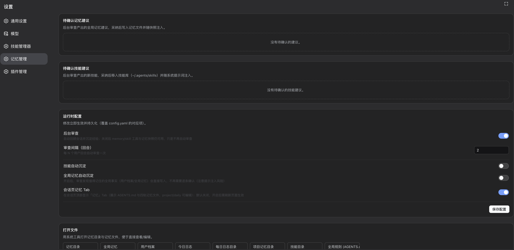
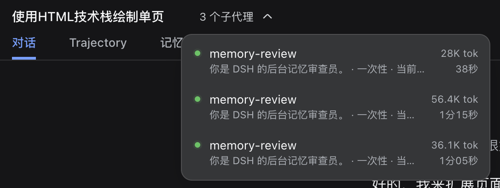
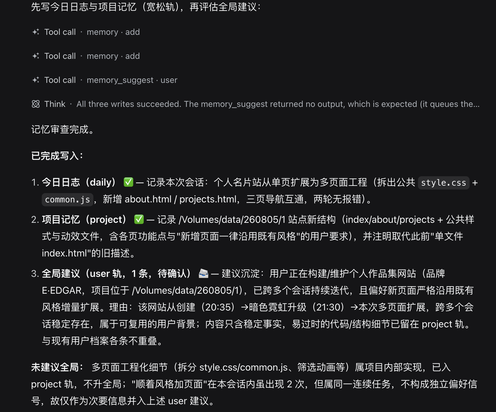

# dsh-memory-evolve

为 DeepSeek Harness 带来 Hermes 式「记忆 + 自我进化」能力的纯插件实现：**零核心修改、零运行时依赖**，随装随用、卸载即净。

> **📖 记忆与审查规则（功能说明）**：[docs/rules.md](docs/rules.md) —— 四层记忆如何工作、审查何时触发与产出什么、什么该记什么不该记、哪些需要你确认。README 只讲安装与配置。

## 特性

- **分层记忆（四轨）**：用户档案 · 全局事实 · 项目记忆（按工作目录隔离）· 每日日志，注入范围随层级收窄，互不污染；
- **后台审查**：每 N 个用户回合自动回顾会话（**增量转录**：每次只摘要上次审查以来的新对话），产出记忆建议、追加项目/每日记忆，并创建/优化技能；支持 `/memory_now` 手动触发与会话关闭终局补审；
- **可追溯审查**（可选）：配合 [dsh-session-search](https://github.com/dsh-external/dsh-session-search) 插件安装时，审查子代理可在摘要信息不足时按需读取完整会话（不装也完全正常，仅失去深读能力）；
- **技能自我进化（创建需确认）**：审查子代理优化 `~/.agents/skills` 下已有技能（read-before-write 保护）；**新技能默认进入待确认队列**，设置面板采纳后才移入技能库（创建门槛严格：多次踩坑、难度大、后续会复用才创建）——技能注入所有会话，必须克制；
- **建议确认制**：全局记忆（用户档案/全局事实）写入需经设置面板或 `/memory_review` 确认；新技能同样需确认，杜绝无人把关的自我修改；
- **安全设计**：防漂移备份、跨进程文件锁、原子写、字符上限、提示注入扫描、禁用技能保护；
- **缓存友好**：记忆快照走 user-role 尾部消息注入（变更检测），system prompt 与历史前缀保持稳定。**只注入低频变化的全局轨**（用户档案/全局事实）——项目记忆与每日日志每次审查都会变化，若注入会导致每轮追加新的上下文快照、前缀缓存命中率下降，因此它们**默认不注入**，改为按需读取（快照中保留一行稳定提示告知模型可随时读取）。

## 分层记忆

| 层 | 内容 | 注入方式 | 写入方式 |
|---|---|---|---|
| 用户档案（`user`） | 用户是谁、偏好、沟通方式 | 每会话注入（低频变化，缓存友好） | 建议确认制（`/memory_review`） |
| 全局事实（`memory`） | 环境、工具、惯例 | 每会话注入（低频变化，缓存友好） | 建议确认制 |
| 项目记忆（`project`） | 当前项目的约定与进展 | **不注入**，按需读取（`memory` 工具，按 cwd 隔离） | 后台自动沉淀 |
| 每日日志（`daily`） | 今天做了什么 | **不注入**，按需读取（`memory` 工具） | 后台自动沉淀 |

记忆文件位置（默认 `~/.dsh/memories/`）：

```
~/.dsh/memories/
├── MEMORY.md                       # 全局事实（§ 分隔条目，与 Hermes 格式兼容）
├── USER.md                         # 用户档案
├── SUGGESTIONS.jsonl               # 待确认建议队列
├── daily/YYYY-MM-DD.md             # 每日日志（按天分文件）
└── projects/<cwd-hash>/MEMORY.md   # 项目记忆（每个工作目录独立）
```

## 安装

```sh
mkdir -p ~/.dsh/plugins
cp -r dsh-memory-evolve ~/.dsh/plugins/
ln -s ~/.dsh/plugins/dsh-memory-evolve ~/node_modules/@dsh-local/dsh-memory-evolve
```

在 `~/.dsh/config.yaml` 追加：

```yaml
- insert:
    - id: dsh-memory-evolve
      name: '@dsh-local/dsh-memory-evolve'
      config:
        reviewEnabled: true      # 开启后台审查（默认关）
        reviewInterval: 10       # 每 10 个用户回合审查一次
```

重启 `dsh web` 即生效。卸载：删除 config.yaml 中的 insert 行 + 删除软链与目录，一切效果随插件卸载自动清理。

## 用法

### 模型侧

agent 会通过 `memory` 工具读写记忆，通过 `skill_manage` 工具管理技能。用户也可以直接说"记住 XXX"。

`memory` 工具参数：`action`（add / replace / remove / list）+ `target`（memory / user / project / daily）。

- `memory add target=project content=...`：写入当前项目的记忆；
- `memory list target=daily`：查看今日日志；
- replace/remove 用唯一子串片段匹配。

### Web 设置面板（推荐）

`dsh web` 左下角设置 → **记忆管理**：

- **待确认建议**：列出全部待确认建议，**采纳前可编辑文本**（修改后再入库），逐条「采纳 / 拒绝」或批量处理（设置入口的导航行会显示 `记忆管理 (N)` 数字徽标）；
- **待确认技能**：审查创建的新技能在此「采纳」（移入技能库，立即生效）或「拒绝」；
- **运行时配置**：`reviewEnabled` / `reviewInterval` / `reviewMode` / `skillReviewEnabled` / `autoApproveGlobal` / `memoryTabEnabled` 的表单修改，保存后**立即生效并持久化**（覆盖 config.yaml 对应项，重启不丢）；
- **打开文件**：一键用系统工具打开记忆目录 / 全局记忆 / 用户档案 / 今日日志 / 项目记忆目录 / 技能目录。



### 会话页记忆 Tab（可选）

开启「会话页记忆 Tab」（配置 `memoryTabEnabled`，默认关，开启后刷新页面生效）后，会话页顶部出现「记忆」标签页：直接预览 AGENTS.md / 长期记忆 / 用户档案（只读），编辑项目记忆与今日日志（保存即写文件），每行可一键用系统工具打开。


### 用户侧命令


```
/memory_review                  # 列出待确认建议（带序号）
/memory_review approve 1 3      # 采纳第 1、3 条（写入对应记忆文件）
/memory_review reject 2         # 拒绝第 2 条
/memory_review approve-all      # 全部采纳
/memory_review reject-all       # 全部拒绝
/memory_now                     # 立即对当前会话触发一次后台审查
```

### 后台审查

- 触发：每 `reviewInterval` 个用户回合（`agent/settled` 计数，仅 message 回合）；会话关闭时未审查过的会话自动补一次终局审查；`/memory_now` 可随时手动触发；
- 转录：**增量**——每次从上次审查的水位线之后重建只读对话转录（只含用户输入与助手文本回复，不含工具调用/思考/系统注入），并附【会话信息】追溯头（会话 ID、工作目录、覆盖事件区间）；
- 执行：派生一个受限子代理（工具白名单：`memory` / `memory_suggest` / `skill_manage`，若已安装 dsh-session-search 则再加 `agent_session_read`），同时产出：
  - 全局记忆建议 → `memory_suggest` → 建议队列（等用户确认）；
  - 项目/每日记忆 → `memory` 工具直接写入（隔离层自动沉淀，宽松：每个会话至少 1 条，纯寒暄除外）；
  - 技能 → `skill_manage` 自动创建/优化 `~/.agents/skills` 下的技能；
  - 深读（可选）：摘要信息不足时，用 `agent_session_read` 读取完整会话，或 `memory target=project/daily` 按需查阅；
- 并发：同时最多一个审查；异步执行不阻塞主流程；`origin: 'subagent'` 的会话永不触发（防递归）。

每次审查会派生一个「memory-review」子代理，在会话列表中可见（子代理详情可查看它读取的转录与产出的建议/技能）：




## 配置

| 键 | 默认 | 说明 |
|---|---|---|
| `memoryDir` | `~/.dsh/memories` | 记忆目录 |
| `memoryCharLimit` | 2200 | 全局事实字符上限 |
| `userCharLimit` | 1375 | 用户档案字符上限 |
| `dailyCharLimit` | 8000 | 每日日志字符上限 |
| `projectCharLimit` | 2200 | 项目记忆字符上限 |
| `entryDatePrefix` | `true` | 记忆条目自动加时间前缀：全局轨 `[YYYY-MM-DD]`、项目轨 `[YYYY-MM-DD HH:MM]`、每日日志 `[HH:MM]` |
| `injectMemory` | `true` | 记忆快照注入开关（只注入低频变化的全局轨 + 一行按需提示；项目/每日内容按需读取，不注入） |
| `injectionScan` | `true` | 写入内容的提示注入短语扫描 |
| `toolName` | `memory` | 记忆工具名 |
| `skillDir` | `~/.agents/skills` | 技能写入目录（DSH 与 Hermes 共同扫描） |
| `skillManageToolName` | `skill_manage` | 技能管理工具名 |
| `skillMaxBytes` | 65536 | SKILL.md 大小上限 |
| `skillReviewEnabled` | `false` | 技能自动沉淀：关（默认）= 审查创建的新技能进待确认队列；开 = 直接创建无需确认 |
| `reviewEnabled` | `false` | 后台审查总开关 |
| `reviewInterval` | 5 | 每 N 个用户回合审查一次 |
| `reviewDigestEvents` | 40 | 转录尾部**消息**条数（≈20 轮对话，不含流式 chunk） |
| `reviewDigestMaxChars` | 40000 | 转录长度上限（单条消息超长时头尾保留，中间标注省略字符数） |
| `reviewProvider` / `reviewModel` | 空（主模型） | 审查用模型 |
| `reviewMode` | `suggest` | `suggest`=全局记忆只产建议；`auto`=直接写（每次写前请求批准） |
| `reviewFinalOnDispose` | `true` | 会话关闭时未审查会话自动补审 |
| `reviewNowCommandName` | `memory_now` | 手动触发审查的命令名 |
| `autoApproveGlobal` | `false` | 全局轨（user/memory）自动沉淀：开启后审查子代理直接写入，无需确认（注意提示注入风险） |
| `memoryTabEnabled` | `false` | 会话页「记忆」Tab 开关：开启后会话页顶部可查看/编辑记忆文件（project/daily 可编辑，全局轨只读）；默认关，开启后刷新页面生效 |
| `reviewProviderName` | `spawn` | 审查子代理提供者 |

## 安全设计

- **分层隔离**：全局记忆（每会话注入）是高风险面——自动写入被拒，只走建议确认；项目记忆按 cwd 硬隔离（A 项目会话看不到 B 项目记忆，且内容不注入、仅按需读取）；每日日志不注入；
- **read-before-write**：`skill_manage` 优化已有技能前，必须先在会话日志中证明 `read` 过（防凭空改写他人技能）；
- **禁用技能保护**：写入前查 DSH 核心技能注册表的 `modelInvocable` 状态，禁用的技能不更新；
- **防数据丢失**：文件无法被解析器往返时拒绝重写并备份 `.bak.<时间戳>`；字符上限硬拒绝；跨进程锁 + 原子写；
- **提示注入防护**：写入内容扫描"忽略指令"类短语；技能 frontmatter 做 YAML 兼容性校验（description 需双引号，防 DSH 解析器静默跳过）；
- **防递归**：审查子代理（subagent 会话）永不触发审查；
- **缓存友好**：快照变更走尾部追加，不破坏 system prompt 前缀缓存；
- **可关停**：全部注册都是 fiber effect，卸载插件即完全恢复原状。

## 工作原理

```
用户会话进行中
  └─ 每 reviewInterval 个用户回合（agent/settled 计数）或会话关闭补审或 /memory_now
       └─ 从上次审查水位线起重建只读对话转录（最多 reviewDigestEvents 条消息 + 【会话信息】追溯头）
            └─ 派生受限子代理（白名单：memory / memory_suggest / skill_manage / [agent_session_read]；origin=subagent 不触发审查）
                 ├─ 全局记忆建议 → SUGGESTIONS.jsonl → 用户 /memory_review 确认 → 写入
                 ├─ 项目/每日记忆 → memory 工具直接写入（隔离层自动沉淀）
                 ├─ 深读（可选）→ agent_session_read 读取完整会话 / memory 按需查阅
                 └─ 技能 → skill_manage 自动创建/优化 ~/.agents/skills
                      └─ 快照注入（仅低频变化的全局轨 + 按需提示行）随上下文刷新，模型可见；项目/每日按需读取
```

## 已知局限：缓存命中

本插件对 LLM 前缀缓存的优化是**尽力而为，并未彻底解决**：

- **已做**：快照只注入低频变化的轨（全局记忆/用户档案），项目记忆与每日日志内容不注入——它们每次审查都会变化，注入会导致每轮追加新上下文快照；
- **未解决**：DSH 的运行时上下文是 **append-only 的 user-role 尾部快照**（`Current runtime context…`），无法原地更新。因此**任何**快照内容变化——例如用户确认一条新建议、直接 `memory add` 写入全局轨——都会使快照文本变化，向请求历史追加一条新尾部消息，**该轮起的前缀缓存只能命中到上次快照之前**。写入越频繁，缓存收益越小；
- 这是 DSH 核心 context 机制的固有设计，插件层面无法替换历史快照；若未来 DSH 支持可原地更新的上下文（或 system-role 稳定注入），本插件可直接受益。

## 可选增强：dsh-session-search

后台审查的「深读」能力依赖 [dsh-session-search](https://github.com/dsh-external/dsh-session-search)（跨会话全文搜索 + 会话读取工具，私有仓库，需 SSH 凭证安装）。**未安装时本插件完全正常运行**——仅审查子代理无法按需读取完整会话，摘要式审查不受影响。插件会在该工具已注册时自动把 `agent_session_read` 加入审查子代理白名单。安装方法见该仓库 README。

## 测试

```sh
cd dsh-memory-evolve && node --test 'tests/*.test.js'
```

## License

MIT
