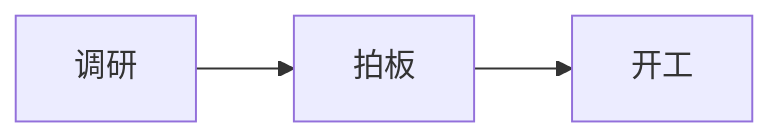

# DSH Mermaid 显示支持调研

日期：2026-08-10
状态：调研完成，待拍板
决策人：用户

## 1. 结论摘要

**DSH Web GUI 聊天界面不渲染 Mermaid**，所有 ```mermaid 代码块一律显示为普通代码文本（带语言标签与复制按钮，无语法高亮）。界面上偶尔出现的"图表"不是 Mermaid 渲染的结果，而是模型直接输出远程图片链接（http/https），DSH 的图片渲染支持这类 URL。

## 2. 渲染管线事实（源码依据：DSH checkout test-csyangwen）

| 环节 | 文件 | 对 mermaid 的处理 |
|---|---|---|
| 解析 | packages/client/ui-primitives/src/markdown/parse.ts | micromark 解析出 code 节点（lang=mermaid） |
| 渲染 | packages/client/ui-primitives/src/markdown/render.tsx | `renderCode` 仅特判空 fence 与 `lang === 'math'`（KaTeX）；其余一律走 CodeBlock |
| 高亮 | packages/client/ui-primitives/src/markdown/highlight.ts | Shiki 语法白名单 `LANG_ALIASES`，**无 mermaid** → 纯文本降级 |
| 代码块 | packages/client/ui-primitives/src/markdown/CodeBlock.tsx | banner 显示语言名 "mermaid" + 复制按钮 |
| 构建产物 | apps/web/dist | 无任何 mermaid 代码 |

- `render.tsx` 的 `renderCode`：唯一特判是 `lang === 'math'` 时走 `renderTexToReact`（rehype-katex 对齐）。mermaid 没有分支，也不会在未来语法里"意外命中"。
- `highlight.ts` 的 `LANG_ALIASES`（约 40 个语言 id/别名，含 ts/bash/json/python/rust/markdown/sql 等）是唯一的高亮入口，mermaid 不在其中，`highlightToHtml` 返回 undefined → CodeBlock 纯文本渲染，永不报错。

## 3. 仓库里 mermaid 依赖（mermaid@11.16.0）的真实用途（与 GUI 无关）

| 用途 | 位置 | 说明 |
|---|---|---|
| 文档门禁校验 | scripts/verify-mermaid.ts + run-gates.ts（`pnpm mermaid`） | 用 `mermaid.parse` 校验仓库内 README/docs/packages/skills 的 mermaid 块语法正确性（只查语法，不渲染） |
| 文档图生成 | scripts/gen-module-graph.ts / gen-doc-graphs.ts | 为 docs/*.md 生成 mermaid 源码 |
| 官网文档站 | website/（vitepress + vitepress-plugin-mermaid） | 官方文档站渲染 mermaid——**这是官网，不是 Web GUI** |

## 4. "有时能显示、有时显示不出来"的机制

- markdown 图片渲染只接受**绝对 http(s) URL**（`render.tsx` 的 `sanitizeUrl` 协议白名单：http/https/mailto；data: URI、相对路径、内嵌 SVG 一律被拒绝）。
- 模型输出图表有两条路径：
  1. 输出 ```mermaid 源码块 → GUI 显示为代码文本（能复制、能看源码，但不是图）；
  2. 输出图片 URL（如 mermaid.ink、GitHub raw 等生成的图片链接）→ GUI 显示为图片。
- 因此"能不能看到图"取决于**模型本次选择了哪种输出形式**，与 DSH 是否支持 mermaid 无关。在 Obsidian/ChatGPT/飞书等能渲染 mermaid 的工具里同样的源码是图，在 DSH 里是代码，造成"时有时无"的观感。

## 5. 支持矩阵

| 场景 | 是否渲染 mermaid |
|---|---|
| Web GUI 聊天消息 | ❌ 纯代码文本（无高亮，可复制） |
| 工具输出 / run_code 渲染 | ❌ 同一 CodeBlock 路径 |
| 官方文档站（website/） | ✅ vitepress-plugin-mermaid |
| 仓库文档语法门禁 | ✅ 仅语法校验，非渲染 |

## 6. 若需要支持，可选方向（供拍板，未开工）

| 方案 | 思路 | 代价/风险 |
|---|---|---|
| A. 官方需求 | 给 DSH 核心 render.tsx 的 renderCode 加 mermaid 分支（动态 import mermaid.js，渲染为 SVG，失败降级回代码块） | 需官方采纳；mermaid.js 约数百 KB，需按需加载、与增量渲染（incremental.ts 流式缓存）协调；有成熟先例（math 分支同款做法） |
| B. 客户端插件增强 | 通过 ui-slots 注入渲染器替换/增强 code 节点渲染 | 需验证 DSH 消息渲染管线是否暴露可替换挂载点（conversation.view 等 slot 大概率不能替换 MarkdownText 内部节点），可行性待验证 |
| C. 模型侧约束（零开发） | 在提示词/纪律里要求模型输出图表时优先给"图片 URL"而非 mermaid 源码 | 治标：模型不一定遵守，且图片依赖外链服务 |

## 6.1 插件方案可行性（2026-08-10 补充查证）

**ui-slots 挂载点查证结论：DSH 的 slots 体系没有"消息内容/代码块"级别的挂载点。**

| slot | 位置/性质 |
|---|---|
| conversation.view | ui-conversation 的**会话视图 Tab 环**（主对话、轨迹 timeline 都是它的 tab），容器级，非消息内容 |
| conversation.input.overlay / composer.bar / composer | 输入区 |
| settings.section / settings.trigger 等 | 设置面板 |
| details / sidebar.* / chain.* | 侧栏、详情栏、链面板 |
| surface.injected | 全局注入面 |

**结论：无法通过 slot 替换 MarkdownText 的 code 渲染。可行路径是 client 侧 DOM 增强**——dsh-memory-evolve 已有成熟先例（wide-chat、session-filter、bookmark-injector、ui-settings-features 等均为"client 增强 + host 开关"模式）。

### 6.2 建议方案（待用户拍板）

独立子模块 mermaid 渲染（独立开关 mermaidEnabled，默认关，独立装配）：

```
消息区 DOM (MarkdownText 渲染)
      │  MutationObserver 监听 .md-code-block
      ▼
识别 banner 语言 = mermaid 的块
      │  内容稳定判定（停顿 ~500ms 防抖，避开流式输出中途）
      ▼
动态 import('mermaid')（懒加载 chunk，首次见图才下载，gzip 约 1MB 量级）
      │  mermaid.render()
      ▼
SVG 替换代码内容（保留复制按钮；渲染失败降级回代码块 + 提示）
```

风险点与对策：
1. **React 重渲染覆盖**：DSH 消息 frozen blocks 缓存为 React 元素、一般不重渲染；观察器对已渲染块打标记，重渲染后再次处理（实测验证）。
2. **流式输出中途**：块未闭合时语法错误 → 内容稳定判定后再渲染。
3. **体积**：懒加载分包 + 浏览器缓存。
4. **暗色主题**：mermaid 主题跟随 DSH 主题（初始化时按 CSS 变量/主题切换调整）。

分期：
- 一期（核心验证）：开关 + 观察器 + 懒加载 mermaid + SVG 替换 + 失败降级；验证流式/历史回放/重渲染不覆盖。
- 二期（体验）：主题适配、错误提示、展开查看源码。

### 6.3 定稿方案（2026-08-10 用户拍板开工，一期）

**开关位置**（用户拍板）：DSH UI 设置 Tab「综合」子 tab 的功能开关列表新增一行「Mermaid 图表渲染」（与 wide-chat/session-filter/context-warn 同款：localStorage + 事件广播，默认关，PC/手机同一界面都能开关，按设备独立记忆）。

**双端支持结论**（用户提问查证）：手机端不是独立应用，是同一个 Web GUI 包进 dsh-android-edapp 外壳（mobile.css 等是同一界面的响应式适配）；消息渲染链路两端同一套代码，DOM 增强天然双端生效。手机特有处理：`.me-mermaid-wrap` 容器 `overflow-x:auto` 防大图横向撑爆、懒加载 + 停顿防抖照顾弱机。

**加载架构**（查证 build.mjs 后定稿）：插件零运行时依赖 + client bundle 是 esbuild 单文件——mermaid（3.4MB）**不打包进 bundle**，改为：
- 宿主端静态端点 `GET /memory-evolve/mermaid/mermaid.min.js`（lib/mermaid.js，跟随 DSH UI 设置模块生命周期装/卸，vendor/mermaid.min.js 文件入库，mermaid@11.16.0 MIT）；
- client 首次见到 mermaid 块才 `<script>` 注入引擎（懒加载 + 浏览器缓存），之后零开销。

**实现文件**：lib/mermaid.js（host 端点）、src/client/mermaid-render.ts（观察器 + 稳定判定 + 渲染 + 降级）、src/client/mermaid-render.css、ui-settings-features.ts / UiSettingsView.tsx / index.ts（开关接入 + zh/en 词典）。

## 7. 附：可验证样例

以下代码块在 DSH GUI 中只会显示为代码文本：


